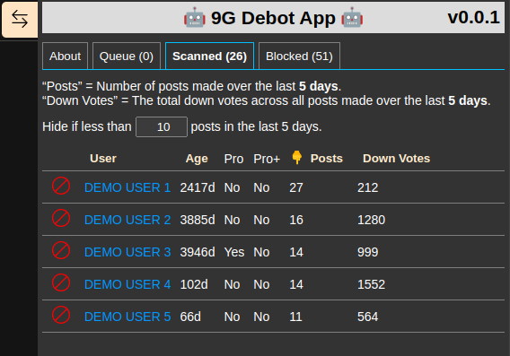
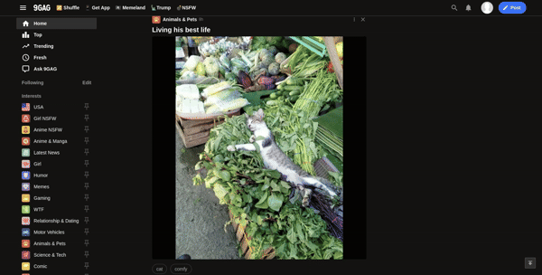

# 9g Debot App

The purpose of this application is to help identify content spammers / bots and provide a quick and easy way to add them to your block list.

It has been designed and tested to work with Chromium-based browsers (recommend [Brave](https://brave.com)). Odds are it'll work out-of-the-box with Firefox but has not officially been tested yet.

🛑 ***This application hooks into the site's API for post analysis and actions on your behalf. There are zero guarantees given! Use at your own risk!***

-----
### Installation Methods
1. Tampermonkey (**recommended**).
   - Automatically keeps the application up to date and no console pasting involved.
   - Latest userscript can be found here: https://github.com/hp99-git/9g-debot/raw/refs/heads/main/tampermonkey/9g-debot.user.js
1. Prebuilt Release & Browser Console.
   - Download a release: https://github.com/hp99-git/9g-debot/releases
   - Extract, open `9g-debot.js` and copy its contents.
   - In your browser, navigate to the site, hit F12 to open your developer tools, switch to the "Console" tab, paste in the contents and hit enter.
   - The app will load on the right side of the screen and you can then close the developer tools.
1. Build it Yourself.
   - If you don't trust random compiled code from the internet, ***which as a general rule you shouldn't***, you can always download the code, inspect, and build it yourself.
   - Requirements: NodeJs
   - Developed under Linux and will require changes to package.json run script and compress.sh to build on Windows.
   - Download and extract the code, then:
     - `npm i`
     - `npm run build`
   - You'll then find `app.js` (uncompressed version) and `9g-debot.js` (gzip version) in the `dist` directory as well as `9g-debot.user.js` in the Tampermonkey directory.
   - Run the app the same way as method #1 or #2 above.

### Inject Via Console Example:

